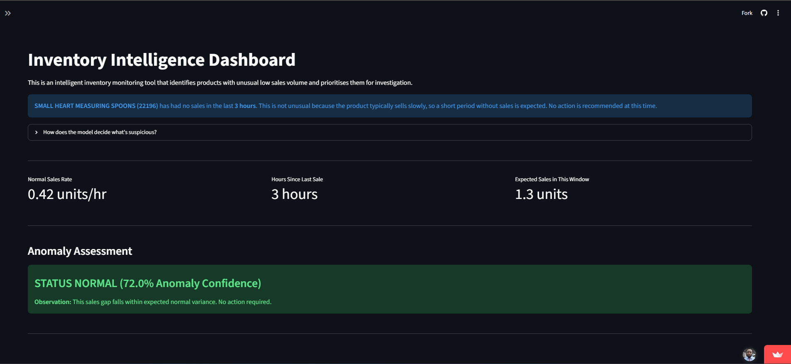
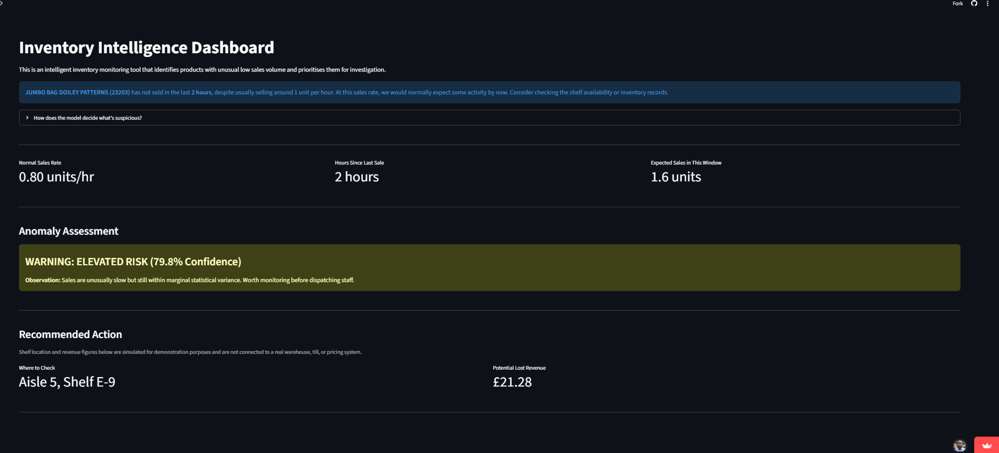
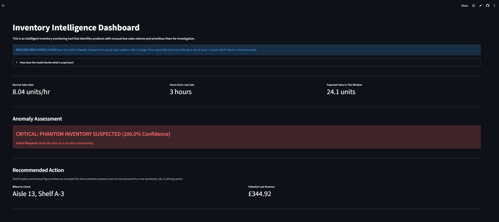

## Inventory Intelligence Dashboard

**An early-warning system for "missing" inventory that may not actually be on the shelf.**

**Live demo:** https://inventory-intelligence-dashboard.streamlit.app/
**Dataset:** [UCI Online Retail Dataset](https://archive.ics.uci.edu/dataset/352/online+retail)

---

## The Phantom Inventory Problem

Phantom inventory is stock that appears in a company's system as available, but is physically absent from the shelf due to misplacement, damage, shrinkage, or theft.

Imagine you manage a retail store and a product hasn't sold in 6 hours. Is that normal? Maybe it's just a slow-moving item, or a quiet time of day. Or maybe it's been stolen, misplaced on the wrong shelf, or the listing is broken. Walking the floor to manually check every slow-moving item wastes staff time, but ignoring the problem may mean an item sitting on a shelf nobody can find.

This dashboard tackles that problem with statistics instead of guesswork. It asks one question for any product: "given how fast this item normally sells, how unusual is it that we've seen zero sales for this many hours?", if the answer is "extremely unusual," the item gets flagged for a check.

**Why this matters to a business:** random manual inventory checking alone cannot resolve this problem. A store with thousands of SKUs (Stock Keeping Units) cannot have staff walk every aisle every hour. A statistical early-warning layer lets the staff focus their time only on the handful of products where something is genuinely likely to be wrong, rather than checking everything or checking nothing.

---

## A note on the dataset

This project deliberately repurposes a well-known, publicly available dataset. The UCI Online Retail dataset rcontains data on a UK-based and registered non-store online retail, not physical shop-floor sales.

I chose to treat the UK-filtered subset of this data as a stand-in for a single retail branch, because the underlying statistical pattern this project demonstrates, which is detecting unusually long gaps between sales events, is transferable regardless of the original context. The goal of this project is not the dataset itself; it's showing I can take a familiar, publicly available dataset and apply a different analytical lens to it to solve a different business problem.

This is a conscious framing decision, not a misunderstanding of the data. I explain exactly where the "branch" framing came from below.

---

## How it works

The core of this system is a real-time anomaly detection engine powered by a **Poisson Distribution** model. This statistical framework calculates the exact probability of an event occurring a specific number of times within a fixed interval, given a known, constant historical average rate.

1. Estimating the Baseline Sales Velocity
Using historical transaction logs, the dashboard calculates a baseline sales rate ($\lambda$) for each unique product (SKU), defined as:

$$\lambda = \frac{\text{Total Units Sold}}{\text{Total Operational Hours}}$$

2. Measuring Operational Silence
The engine tracks the elapsed time ($t$, in hours) since the last recorded scan of that SKU at the till. The expected number of sales during this quiet window is calculated as:

$$\text{Expected Sales } (\mu) = \lambda \times t$$

3. Calculating Anomaly Confidence
To determine if a sales gap is down to random statistical variance or a physical shelf issue (phantom stock), the model evaluates the probability of observing exactly **zero sales ($k=0$)** given our expected baseline:

$$P(k=0) = \frac{\mu^0 \cdot e^{-\mu}}{0!} = e^{-\mu}$$

The system then converts this probability into an **Anomaly Confidence Score**:

$$\text{Confidence (\%)} = (1 - P(k=0)) \times 100$$

4. Operational Translation & Actionable Output To ensure the tool is practical for front-line store associates, the complex underlying probabilities are abstracted into clear, binary risk tiers. Staff can act immediately on the data without needing to understand the mathematics behind it:

* **Status Normal (< 85% Confidence):** The sales gap falls within expected normal variance. No action required.
* **Elevated Risk (85%–95% Confidence):** Out-of-the-ordinary sales lag; flagged on the dashboard for remote monitoring.
* **Critical Alert (≥ 95% Confidence):** It is mathematically highly improbable that a healthy product would experience a silence this long. The item is flagged as a likely phantom-inventory issue. The dashboard isolates the SKU, displays its simulated aisle location, estimates the missed revenue, and outputs a clear directive for staff to physically check the shelf.
---

## Discovering the trading hours from the data itself

From the Invoice Date column in the data set, which cointains the hour and the minute of the sale, the hour alone is filtererd out to represent the time of the transaction and then I checked when transactions actually occur in the dataset.

| Hour | Transaction Volume |
| --- | --- |
| **06:00** | 1 |
| **07:00** | 3,798 |
| **08:00** | 8,687 |
| **09:00** | 21,927 |
| **10:00** | 37,773 |
| **11:00** | 48,365 |
| **12:00** | 70,938 *(Peak)* |
| **13:00** | 63,019 |
| **14:00** | 53,251 |
| **15:00** | 44,790 |
| **16:00** | 23,715 |
| **17:00** | 12,941 |
| **18:00** | 2,895 |
| **19:00** | 3,233 |
| **20:00** | 778 |

There is no activity outside the 06:00–20:00 time therefore I used this **empirically observed 14-hour trading window**, to calculate each product's normal sales velocity — this is what supports treating the UK subset as a single branch with realistic opening hours, rather than an arbitrary framing choice.

---

## What's in the demo dashboard

1. **Simulation sliders** let you manually adjust the sales rate, the length of the sales gap, and the alert sensitivity, to see how the model's judgement responds to different conditions in real time.
2. A **curated set of six example products** is loaded by default, chosen deliberately to show a slow-moving, a medium-moving, and a fast-moving item — making the logic easy to follow without needing to browse the full catalogue.
3. An **"Explore Full Catalogue"** option in the sidebar applies the model across every product in the dataset, not just the curated examples.
4. When an item is flagged, a **Recommended Action** card shows a shelf/pick location and an estimated revenue figure. **Both are simulated** — clearly labelled as such throughout the app — to illustrate what a downstream operational output could look like in a system connected to real warehouse and pricing data.

---

## Why the Poisson distribution?

The Poisson distribution is the standard statistical tool for modelling how many times an event happens in a fixed window, when those events occur independently at a roughly constant average rate. A sales transaction landing in a given hour fits that description reasonably well.

1. **It directly answers the question being asked.** The dashboard needs "how unlikely is this specific length of time without sales?" — Poisson is purpose-built for exactly that (the probability of zero events in a given window).
2. **It needs very little data to work.** More sophisticated models (Negative Binomial, ARIMA, ML regressors) need large volumes of clean, regularly-spaced history per item. Poisson only needs one number — the average rate — making it usable even for lower-volume products where richer models would be unreliable.
3. **Minimal Data Requirements (High Cold-Start Capability):** Unlike complex machine learning models that require months of historical, multi-variable training data, the Poisson model only requires a single parameter: the average historical sales rate ($\lambda$). This makes it incredibly lightweight, highly scalable, and capable of working flawlessly even for low-volume SKUs where more data-hungry models would fail.
4. **Mathematically Optimized for Counts and Intervals:** Sales transactions are discrete, independent events occurring in a fixed interval of time. The Poisson distribution is explicitly designed for this exact data structure, allowing us to mathematically isolate "normal variance" from an actual operational anomaly.
5. **Elegant Operational Abstraction:** While the underlying probability mass function handles complex calculations, the output can be easily transformed into a directional metric. Converting a raw $2\%$ probability of normal occurrence into a $98\%$ "Anomaly Confidence Score" abstracts the statistical complexity away, leaving front-line staff with an intuitive, actionable metric.
6. **It mirrors established practice.** Poisson-derived methods are commonly used in real anomaly detection and quality-control settings (e.g. flagging unusually quiet sensors), so this isn't a novel or unusual choice for this kind of problem.

---

## Limitations

The key limitations of this approach are:

1. **Built on historical averages, not live conditions.** The "normal" sales rate is calculated from past data. Demand can shift week to week or season to season, so a rate accurate last month may not reflect today.
2. **A statistically unusual gap is a signal to check, not proof of a cause.** It doesn't by itself confirm theft, misplacement, or any specific issue — it directs attention efficiently, it doesn't replace physical investigation.
3. **No ground-truth validation.** I don't have a labelled set of confirmed phantom-stock events to test the model's accuracy against — I can't currently say what proportion of flagged items would turn out to be real issues versus false alarms. A production version would need a feedback loop where staff log the outcome of each check, so the model's real-world hit rate could be measured and the threshold tuned accordingly.
4. **Genuine demand spikes or dips look identical to phantom stock.** A promotion, marketing push, or competitor pricing change would produce the same statistical signature as a real inventory problem, since the model has no awareness of external campaigns.
5. **Poisson assumes steady, independent events.** Real retail sales are often "bursty" (e.g. several purchases in quick succession after a social media mention), which this model doesn't account for.
6. **No time-of-day or day-of-week baseline.** The model uses one flat average across the whole trading day, so it can't currently distinguish a quiet mid-afternoon lull from a quiet peak-hour gap. A more advanced version could build in hourly or daily baselines.
7. **Shelf locations and revenue figures in the demo are simulated** for illustration purposes only.

**Why these limitations are included on purpose:** this project is a portfolio demonstration of statistical and analytical thinking, not a plug-and-play production system. Being explicit about a model's assumptions and blind spots is, in my view, just as important as the model itself.

---

## Estimated business impact (illustrative)

For a branch carrying ~4,000 active SKUs, spot-checking every slow-moving item manually is impractical. If this model correctly narrows daily manual checks down to the highest-confidence 1–2% of the catalogue, that is the difference between checking dozens of items a day versus thousands — freeing staff time for other tasks while still catching the gaps most likely to represent a real issue. This is an illustrative estimate based on catalogue size, not a measured result, given the lack of ground-truth validation noted above.

---

## Tech stack

- **Python** — core language
- **Pandas / NumPy** — data cleaning, aggregation, velocity calculations
- **Streamlit** — interactive dashboard interface
- **SciPy (`scipy.stats.poisson`)** — statistical core of the anomaly detection logic

---

## Possible next steps

- Add hourly or day-of-week baselines instead of a single flat velocity.
- Build a feedback mechanism to log real outcomes of flagged checks, enabling actual accuracy measurement.
- Connect simulated shelf-location and pricing data to a real inventory system.
