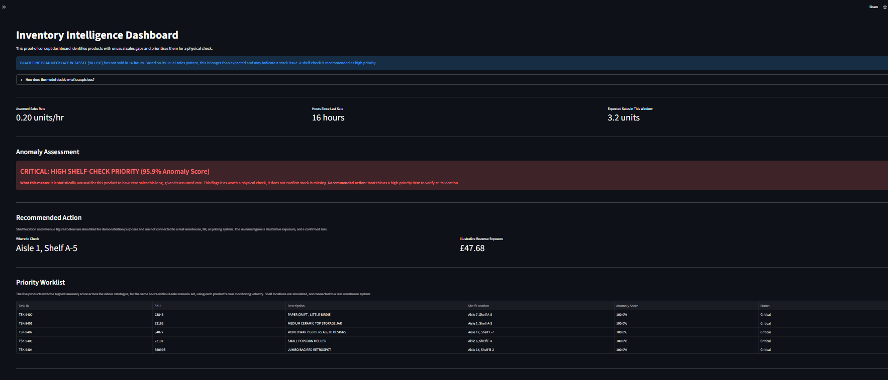
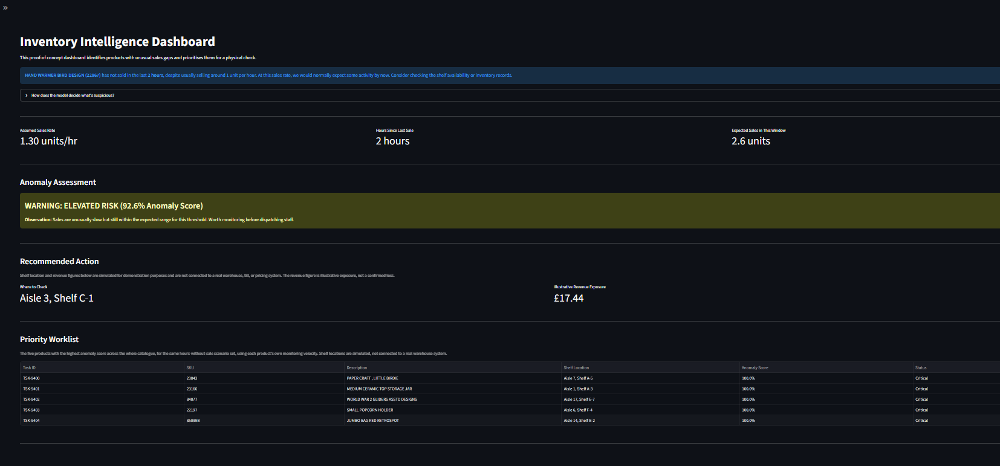
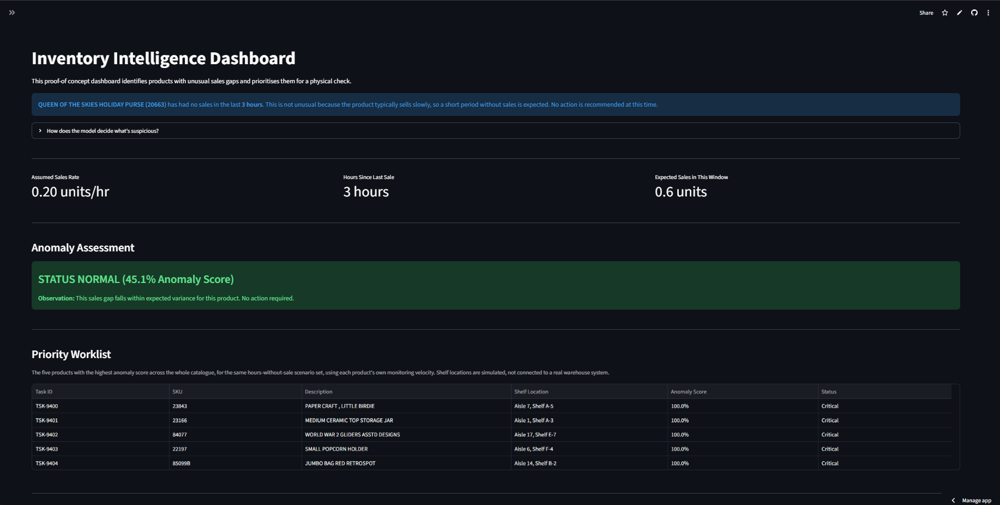

## Inventory Intelligence Dashboard

**A proof-of-concept dashboard that flags products worth a physical shelf check, using statistical anomaly detection instead of manual floor walks.**

**Live demo:** https://inventory-intelligence-dashboard.streamlit.app/
**Dataset:** [UCI Online Retail Dataset](https://archive.ics.uci.edu/dataset/352/online+retail)

This project shows how historical sales patterns can be used to identify which products should be prioritised for a physical shelf check. It does not confirm inventory discrepancies on its own, doing that would require live data from point-of-sale systems, warehouse records, and shelf-availability tools, which sits outside the scope of this project.

---

**Critical example:** a product flagged after 16 hours without sales.

**Warning example:** a product flagged after 2 hours without sales, its normal rate makes even a short gap unusual.

**Normal example:** a slow-moving product remains Normal even after 3 hours without sales, that gap is within its expected range.

---

## The problem

A retail store's inventory system may record an item as available even though it's physically absent, due to theft, misplacement, or damage. Walking the floor to manually check every slow-moving item can be a difficult task, but ignoring the problem may impact the stores revenue in the longrun. A store carrying thousands of products will prefer a solution to both.

## Business objective

Give store and inventory teams a way to prioritise which products to physically check, based on how unusual their current period of no sales is, rather than checking every product, checking none, or relying on staff noticing a gap by chance.

## Proposed solution

A dashboard that compares each product's normal sales rate against how long it's actually gone without a sale, and scores how statistically unusual that gap is. Products are sorted into Normal, Warning, or Critical, so staff know where to look first without needing to understand the statistics behind the score.

## Potential business value

Fewer missed sales sitting unnoticed on a shelf, and less staff time spent on products that were never actually a problem. See [the business case](docs/business-case.md) for what it would actually take to measure whether that holds up.

## Scope

This build covers the detection logic, the scoring model, and an interactive dashboard for exploring how it responds to different sales patterns. It's a proof of concept built on a historical, repurposed public dataset, not a system connected to a live store. What a production rollout would additionally need is set out in [the business case](docs/business-case.md).

## Key assumptions

The UK-filtered portion of the dataset is treated as a single store branch. Sales activity outside the observed trading hours is treated as closed, not a data gap. A product's historical average selling rate is assumed to be a fair baseline for judging how unusual its current silence is, even though real demand shifts over time. Each of these is examined more closely in [the methodology](docs/methodology.md).

## Intended users

Store associates carrying out the physical checks, and store or inventory managers deciding where to send them. The underlying question the dashboard answers for both is the same: which products should we investigate first?

## How the prototype works

Pick a product, or let the dashboard load one of six examples chosen to show a Normal, a Warning, and a Critical result side by side. Sliders let you adjust the product's sales rate, how long it's gone without a sale, and how sensitive the alert threshold is, and the assessment updates as you move them. A worklist below the main result shows the five products currently ranked highest across the whole catalogue for that scenario.

## Success criteria

For this proof of concept, success means the model produces results a non-technical person can read and trust: a clear Normal, Warning, or Critical outcome, faster-selling products getting flagged sooner than slow ones for an equivalent gap, and a threshold that can be adjusted and explored rather than fixed and opaque. It also means being honest about what the model can't yet claim, an anomaly score is not the same as a confirmed missing item.

A production version would be judged differently: how many flagged checks turned out to be real issues, how much staff time was saved versus the old process, and whether stock accuracy actually improved. None of those can be measured yet, since they depend on real outcomes this prototype doesn't have access to.

## Tech stack

Python · Streamlit · Pandas · NumPy · SciPy (Poisson)

## Read more

- [Methodology](docs/methodology.md), the maths behind the score, how the trading hours were derived from the data, and the behaviour checks
- [Limitations](docs/limitations.md), assumptions, constraints, and known weaknesses
- [Business case](docs/business-case.md), stakeholders, process flow, and what a production rollout would need
- [Requirements](docs/requirements.md), the functional and business rules behind the current build
- [Acceptance criteria](docs/acceptance-criteria.md), testable conditions tied to observable application behaviour
- [UAT-style test scenarios](docs/uat-style-test-scenarios.md), self-conducted test scenarios tracing back to the acceptance criteria
- [Process map](docs/process-map.md), current-state and future-state views of the shelf-check workflow
