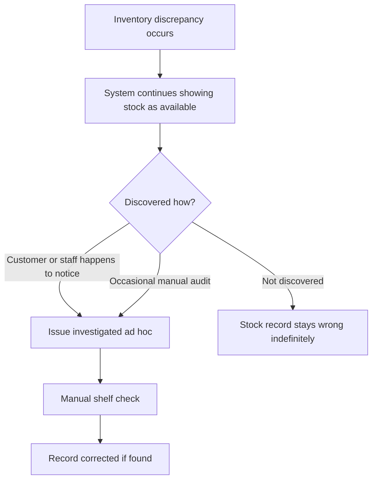
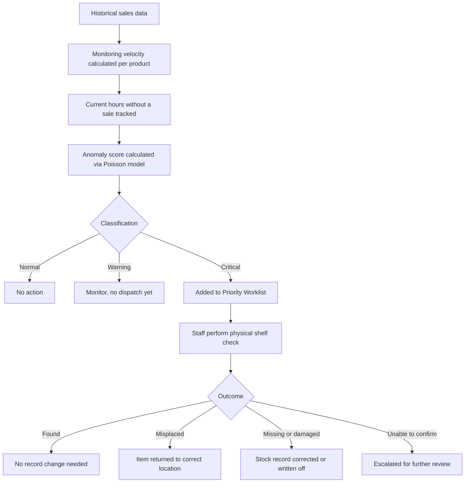

# Process Map

Current-state and future-state views of how a phantom inventory issue is caught today versus how this proof of concept proposes to catch it.

## Current state, manual and reactive

**Key weakness:** discovery depends on chance or infrequent audits. Nothing prioritises which of thousands of SKUs to check first.

## Future state, statistically prioritised

**Key improvement:** staff attention is directed by evidence of unusual inactivity rather than chance discovery or blanket manual audits. The physical check remains the final confirmation step in both states, this system prioritises where to look, it doesn't replace looking.

**What this deliberately doesn't show:** the future-state diagram assumes live inventory and point-of-sale data feeding the monitoring step. In the current build, that step runs against a static historical dataset instead, this diagram shows the target process, not a claim that this proof of concept is fully wired into a live system already.
